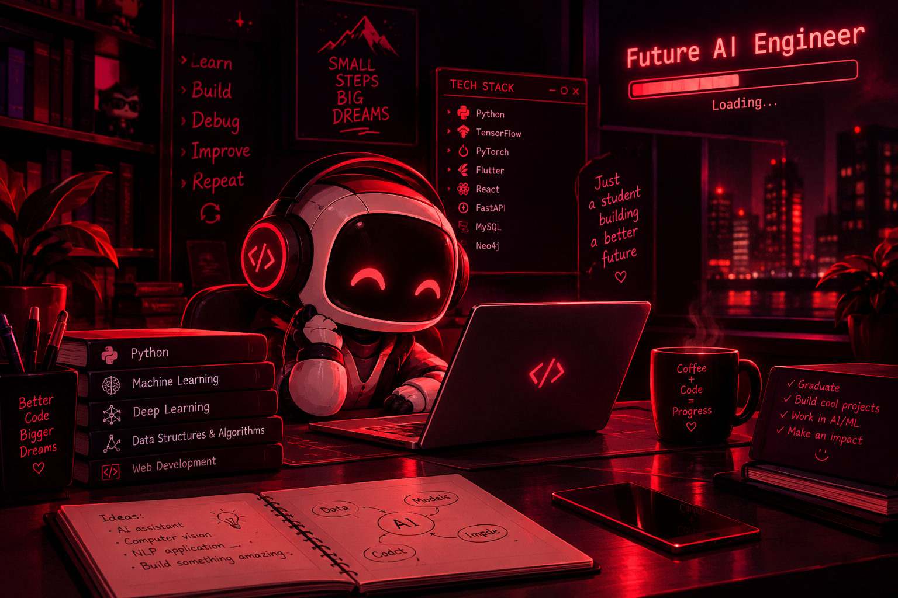

<!-- ========================================================= -->

<!--                    HASSAN HAIDER                          -->

<!-- ========================================================= -->

  

  

<!-- NEW: AI STUDENT ROBOT IMAGE -->

  

  
  
  

---

# 👋 About Me

Hey, I'm <b>Hassan Haider</b> 👋

  

I'm a <b>BS Artificial Intelligence student</b> at the <b>University of Management and Technology (UMT)</b>, Pakistan.

  

My main interests are <b>Artificial Intelligence, Machine Learning,
Natural Language Processing, Deep Learning</b> and <b>Computer Vision</b>.

  

I enjoy building practical projects and learning through implementation —
from data preprocessing and classical machine learning models to NLP systems,
computer vision pipelines and AI-powered applications.

  

I'm currently focused on becoming a stronger <b>AI / ML Engineer</b>
while improving my software development, programming and problem-solving skills.

---

# ⚡ Quick Facts

<table align="center">
<tr>
<td align="center" width="200">

🎓 <b>Education</b>

 

BS Artificial Intelligence
UMT

</td>

<td align="center" width="200">

🤖 <b>Primary Focus</b>

 

AI / ML
Engineering

</td>

<td align="center" width="200">

🧠 <b>Interests</b>

 

NLP • CV
Deep Learning

</td>

<td align="center" width="200">

📍 <b>Based In</b>

 

Lahore,
Pakistan

</td>
</tr>
</table>

---

# 🧠 AI & Machine Learning

<b>Python</b> • <b>scikit-learn</b> • <b>TensorFlow</b> • <b>PyTorch</b> • <b>OpenCV</b> • <b>YOLO</b> • <b>TF-IDF</b> • <b>OCR</b>

 

<b>Machine Learning</b> • <b>Deep Learning</b> • <b>NLP</b> • <b>Computer Vision</b> • <b>Transformers</b>

---

# 💻 Programming Languages

<b>Python</b> • <b>C++</b> • <b>Dart</b> • <b>SQL</b>

---

# 🛠️ Development & Frameworks

<b>Flutter</b> • <b>Dart</b> • <b>FastAPI</b> • <b>Streamlit</b> • <b>Git</b> • <b>GitHub</b> • <b>VS Code</b>

---

# 🗄️ Databases & Data

<b>MySQL</b> • <b>SQL</b> • <b>Neo4j</b> • <b>Pandas</b> • <b>NumPy</b>

---

# 🎨 Other Tools I Use

<b>Canva</b> • <b>Google Colab</b> • <b>Jupyter Notebook</b>

---

# 🚀 Featured Projects

<table align="center">
<tr>

<td width="50%" valign="top">

<h3 align="center">🛡️ ReviewGuard</h3>

An end-to-end machine learning system for detecting suspicious and AI-generated reviews using NLP and behavioral features.

<b>Python</b> • <b>scikit-learn</b> • <b>TF-IDF</b> • <b>ML</b>

</td>

<td width="50%" valign="top">

<h3 align="center">🤖 AI Student Assistant</h3>

An AI-powered study assistant that extracts text from notes and generates summaries, key points and flashcards.

<b>Python</b> • <b>OCR</b> • <b>NLP</b> • <b>AI</b>

</td>

</tr>

<tr>

<td width="50%" valign="top">

<h3 align="center">🏥 Hospital Database</h3>

A relational hospital management database designed to manage patients, doctors, appointments and hospital records.

<b>MySQL</b> • <b>SQL</b> • <b>Database Design</b>

</td>

<td width="50%" valign="top">

<h3 align="center">🎬 Movie Planet</h3>

A Flutter-based movie ticket booking application developed as a university project.

<b>Flutter</b> • <b>Dart</b> • <b>UI Development</b>

</td>

</tr>
</table>

---

# 📚 Currently Learning

<table align="center">
<tr>

<td align="center" width="220">

🧠   <b>Machine Learning</b>

  

Strengthening ML fundamentals and practical implementation.

</td>

<td align="center" width="220">

🤖   <b>Deep Learning</b>

  

Learning deeper concepts around neural networks and Transformers.

</td>

<td align="center" width="220">

💬   <b>NLP Applications</b>

  

Building practical NLP and AI-powered applications.

</td>

<td align="center" width="220">

💻   <b>Software Development</b>

  

Improving Python, programming and end-to-end development skills.

</td>

</tr>
</table>

---

# ⚙️ My Development Mindset

### Learn → Build → Break → Debug → Improve → Repeat

I believe the best way to learn AI and programming is by actually building things,
making mistakes, debugging them and continuously improving.

---

# 📊 GitHub Statistics

  
  

  

---

# 🐍 Contribution Snake

  

---

# 🏆 GitHub Trophies

  

---

# 🤝 Connect With Me

---

<b>💻 Building my skills one project at a time.</b>

  

